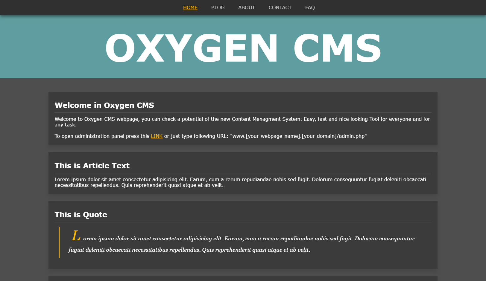

# Oxygen CMS
[](https://badge.fury.io/gh/tterb%2FHyde)



One of my biggest/smallest projects, a own Content Menagment System.<br>
I base my self on WordPress CMS, becouse its well known by the community and its easy, but WP don't had some of functions which I need, then I decided to create my own CMS. More flexible, easier and maybe lighter. Plus this project is really good for learning new things.

## Run project

To test project you just need to clone it or download:
```
$ git clone https://github.com/marcelmos/oxygen-cms.git
```
If you have project use following command:
```
$ php -S localhost:8888 -t public
```
After that just type to your web browser `localhost:8888`.

### IMPORTANT INFO

Following project distribution contains only `static webpage`, a whole admin panel with creating/updating content on page become avilable in future. <br>
On this moment I'm creating a Frontend as a base for future Backend functionalities.

## Author
- Marcel Moś - Developer
